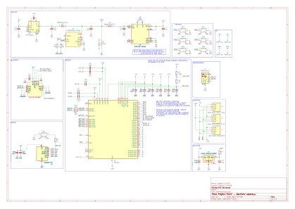
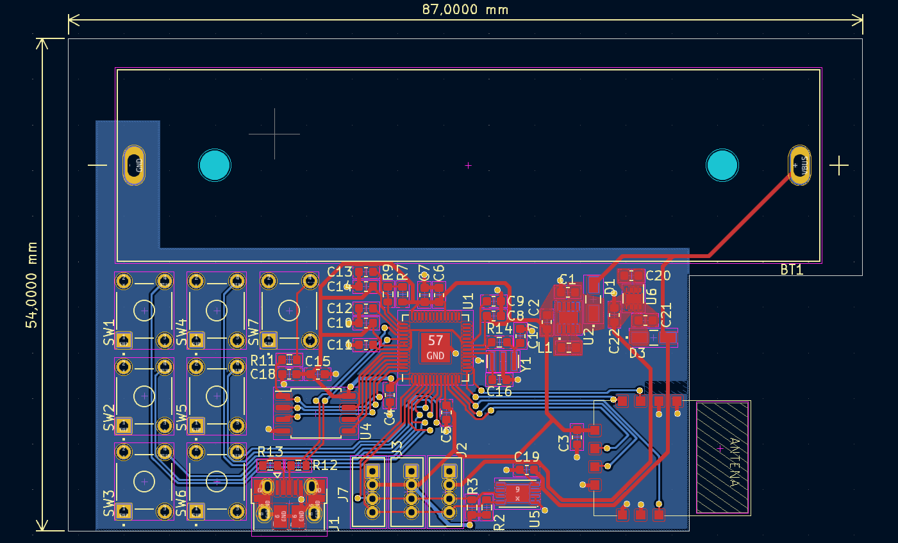
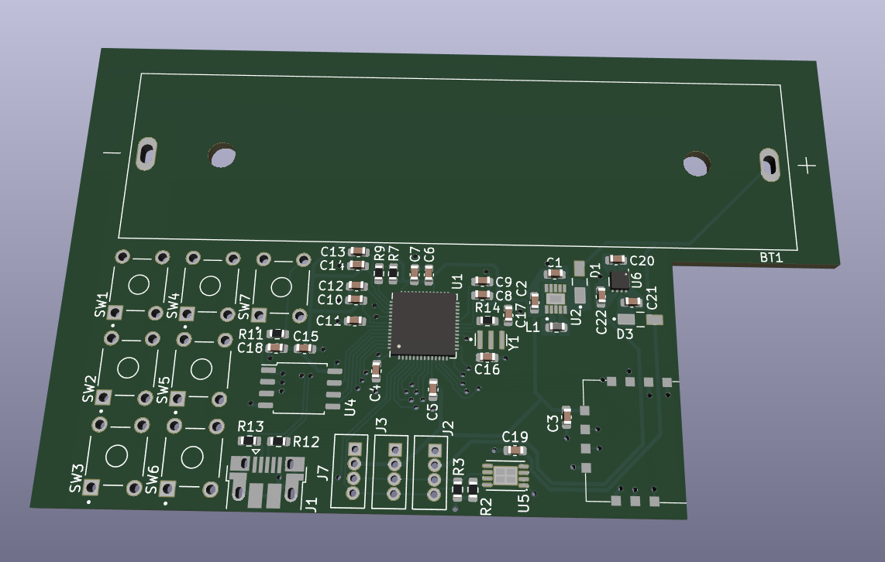
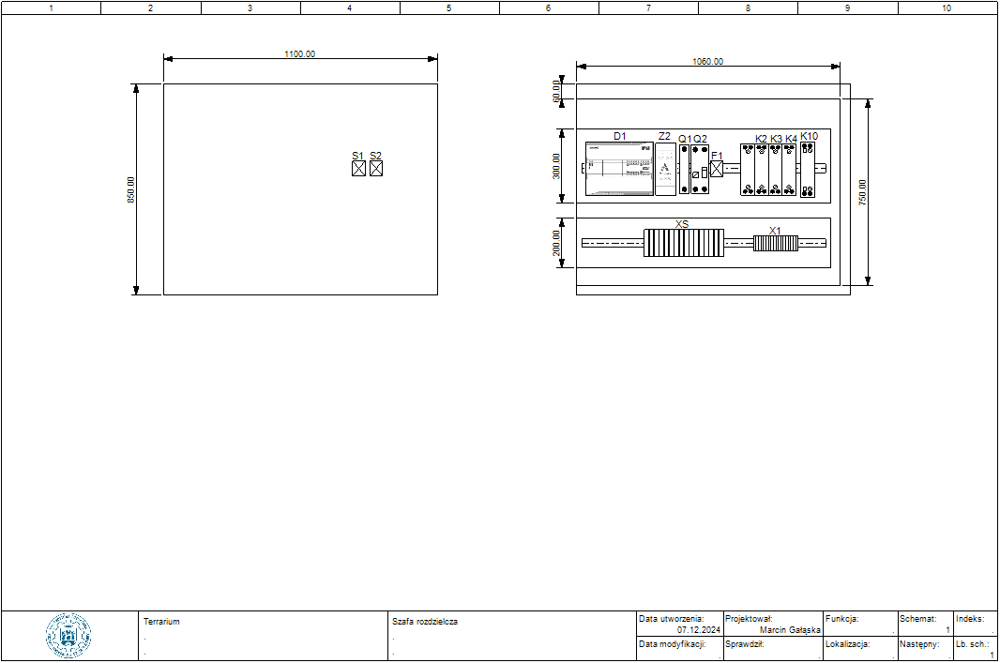

# Projekty PUEIE
To repozytorium zawiera dokumentację oraz projekty wykonane w ramach przedmiotu Projektowanie Układów Elektrycznych i Elektronicznych na 7 semestrze kierunku Automatyka i Robotyka na Politechnice Poznańskiej. Autorami projektów są Marcin Gałąska i Szymon Gogulski.
### Główne cele projektów
1. <b> Opracowanie projektu układu elektrycznego sterującego mikroklimatem terrarium dla kameleona. </b>
    - Układ steruje parametrami mikroklimatu terrarium.
    - Automatyczna regulacja temperatury poprzez jedną dzienną oraz jedną nocną lampę grzewczą. 
    - Automatyczna regulacja oświetlenia poprzez świetlówkę UVB.
    - Automatyczna regulacja wilgotności poprzez zanurzony w zbiorniku wodnym fogger.
    - Pomiar temperatury i wilgotności powietrza poprzez czujniki z przetwornikami.
    - Informowanie o stanie mikroklimatu poprzez panel HMI.
2. <b> Opracowanie projektu układu elektronicznego oraz projektu płytki PCB dalmierza laserowego. </b>
    - Urządzenie wykonuje pomiar odległości czujnikiem laserowym i ultradźwiękowym.
    - Urządzenie jest zasilane z ogniwa LI-ION lub z baterii 9V.
    - Urządzenie posiada 6 przycisków.
    - Urządzenie posiada wyświetlacz LCD 4x20.
    - Urządzenie wykonuje pomiar naładowania akumulatora/ baterii.
    - Urządzenie obsługuje transmisję bluetooth.
***
# Dalmierz
- Projekt opiera się o dokumentację mikroprocesora RP2040.
- Projekt został wykonany w programi KiCad7.0.

### Schemat ideowy projektu

### Schemat elektronicznych

Schemat lepiej widoczny w jasnym motywie GitHub.

### Płytka PCB

### Płytka PCB 3D

### Zasilanie 
1. W celu zasilenia układu wykorzystaliśmy ogniwo li-ion 18650.
2. Układ składa się z dwóch przetwornic: BUCK-BOOST RT6150B-33GQW zapewniającej napięcie 3.3V oraz BOOST LM2775DSG zapewniającej napięcie 5V.
3. Przed wybraniem przetwornic przeprowadziliśmy rachunek poboru prądu przy założeniu najwyższego obciążenia.
4. W ramach możliwości monitorowania stanu naładowania ogniwa zastosowaliśmy moduł LC709203. Moduł ten umożliwia bierzące przekazywanie informacji o stanie ogniwa poprzez interface I2C od mikrokontrolera.
5. Wejścia układu zostały zabezpieczone diodami Schottkiego na wypadek odwrotnego zamontowania ogniwa w gnieździe.

### Czujniki
Czujniki odległości będą podłączane do układu poprzez konektory I2C

### Bluetooth
W ramach umożliwienia możliwości zapisu pomiarów na urządzeniu zewnętrzym dodaliśmy moduł komunikacji bluetooth.

### Macierz przycisków / Wyświetlacz I2C LCD
1. Jako interface użytkownika zastosowaliśmy macierz  sześciu przycisków oraz wyświetlacz I2C.
2. Na płytce zamontowaliśmy osobny konektory I2C umożliwiający podłączenie wyświetlacza.
3. W celu uniknięcia drgań styków lepszym rozwiązanie było by zastosowanie dodatkowych filtrów RC pomiędzy przyciskami oraz mikrokontrolerem.

### RP2040, pamięć Flash i oscylator
Sercem układu jest mikrokontroler RP2040, sugerowany schemat mikrokontrolera, pamięci flash i oscylatora kwarcowego został wykorzystany z ogólnodostępnej dokumentacji.
### Programowanie
Wejści USB micro B zostało aby umożliwić bierzący rozwój oprogramowania.

***

# Terarrium
- Projekt opiera się o sterownik PLC DC/DC/RELAY firmy Siemens serii S7-1200 model 6ES7212-1HE40-0XB0.
- Projekt zostanł wykonany w programie SEE Electrical V8R4.

### Zasilanie
1. Głównym źródłem zasilania układu jest standardowa jednofazowa linia AC 230V 50Hz z przewodem uziemiającym.
2. Obwód zasilania zawiera wyłącznik nadprądowy MCN110E oraz wkładkę bezpiecznikową 1115282107T dla fazy, wraz z wyłącznikiem różnicowoprądowym CFI6-25/2/003 dla żyły fazy i odniesienia.
3. Rozgałęzienia linii głównej przechodzą przez styki stycznika iCT50-25-20-230, włączonego w obwód włącznika i wyłącznika głównego.
4. Podłączonym do głównej linii zasilania jest zasilacz AST-PWR-7524 firmy Astor, konwertujący otrzymywane 230 AC na 24 DC, służące do zasilania szeregu komponentów w układzie.

### Czujniki
Pomiar temperatury wykonywany jest poprzez trójprzewodowy czujnik Pt100 sparowany z przetwornikiem AR580. Pomiar wilgotności powietrza realizowany jest poprzez układ czujnika z przetwornikiem AR250. Oba czujniki przekazują swój sygnał wejściowy z zakresu 0...10V DC na wejścia analogowe sterownika PLC. Oba czujniki zasilane są z linii 24V DC.

### Elementy wykonawcze
Grzanie nocne wykonuje lampa grzewcza Exo Terra Ceramic Heat Emitter 50W PT2044, wkręcona w żaroodporny klosz PT2060. Grzanie nocne wykonuje lampa grzewcza Exo Terra Night Heat Lamp 25W PT2122, wkręcona w żaroodporny klosz PT2060. Oświetlenie terrarium zapewniane jest poprzez świetlówkę Exo Terra Reptile UVB Nano 9W PT2366, wkręconą w klosz PT2364. Elementem nawilżającym powietrze wewnątrz terrarium jest membranowy fogger Exo Terra Fogger Ultrasonic Fog Generator PT2080. Elementy te zasilane są z sieci 230 AC, jednak w swoich obwodach posiadają styki styczników pomocniczych CA3SK11BD, których cewki podłączone są do wyjść cyfrowych sterownika PLC, celem kontroli zasilania każdego z elementów wykonawczych.

### Wizualizacja stanu mikroklimatu
Elementem informującym użytkownika o parametrach mikroklimatu terrarium jest panel HMI Simatic KTP400 6AV2123-2DB03-0AX0 firmy Siemens, połączony ze sterownikiem PLC poprzez złącze Ethernet.

### Szafa rozdzielcza

